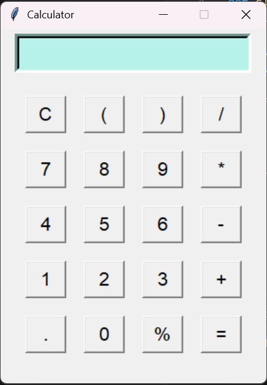

# Tkinter Calculator

A simple, clean calculator app built with Python's built-in `tkinter` library. It supports standard arithmetic operations, percentage calculations, and parentheses for grouped expressions — all through a lightweight GUI with no external dependencies.

## Features

- Basic operations: addition, subtraction, multiplication, division
- Percentage (`%`) support
- Parentheses for complex expressions
- Clear (`C`) button to reset input
- Prevents invalid input like consecutive operators or expressions starting with `*`, `/`, `%`
- Error handling for invalid expressions
- Continue calculations from previous results (chaining)

## Requirements

- Python 3.x
- `tkinter` (included with most standard Python installations)

## Usage

Clone the repo and run the script:

```bash
git clone https://github.com/Obaidullah2020ml/Project-Python-Calculator.git
cd Project-Python-Calculator
python main.py
```

## How It Works

The calculator uses a single `Entry` widget to display input and builds up expressions as button presses are registered. On pressing `=`, the expression is evaluated using Python's `eval()`, with `%` converted to `/100` for percentage handling.

## Screenshot
 

